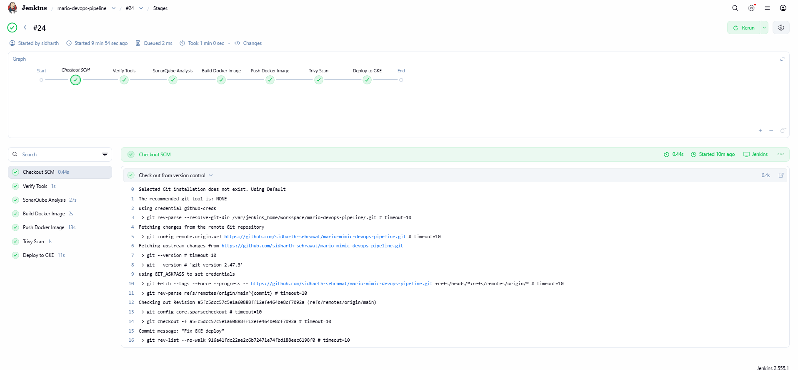
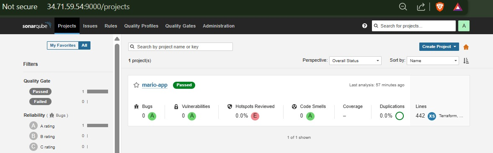
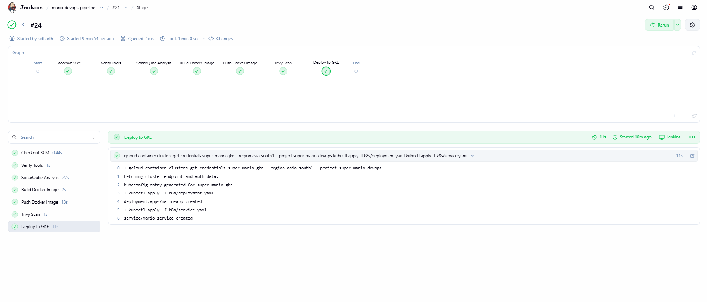
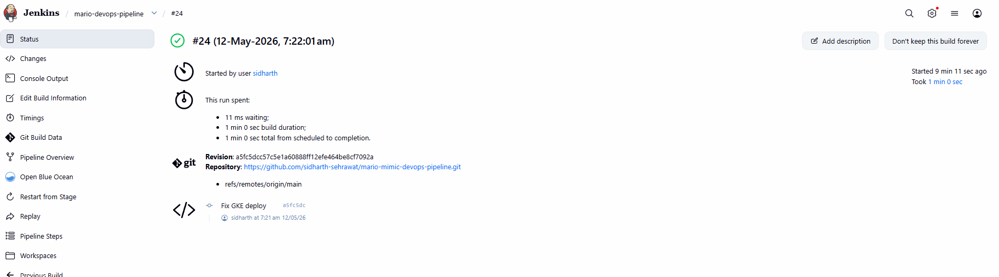
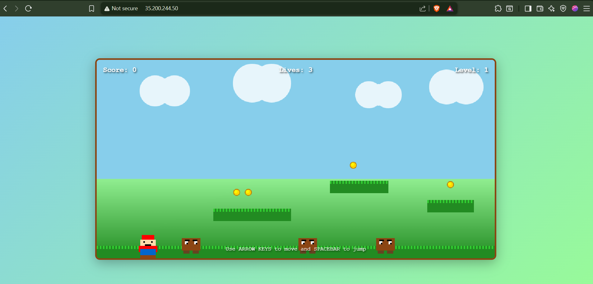

# 🎮 Mario Mimic DevOps Pipeline (Jenkins CI/CD Version)

> Recommended filename: `README-JENKINS.md`
>
> This README specifically documents the Jenkins-based CI/CD implementation.
> The repository also contains a separate GitHub Actions based CI/CD workflow implementation.

Production-grade cloud-native DevOps pipeline on Google Cloud Platform (GCP) using Jenkins, Terraform, Docker, Kubernetes, SonarQube, Trivy, and Google Kubernetes Engine (GKE).

---

# 🚀 Project Overview

This project demonstrates a complete end-to-end DevOps workflow for deploying a containerized frontend application to Google Kubernetes Engine (GKE) using modern DevOps practices.

The application is a browser-based Mario-style game built with React/Vite and deployed through a fully automated Jenkins CI/CD pipeline.

The complete infrastructure and deployment lifecycle is automated using:

* Terraform (Infrastructure as Code)
* Docker
* Jenkins
* Kubernetes (GKE)
* SonarQube
* Trivy
* Artifact Registry
* Google Cloud Platform (GCP)

---

# 🏗️ Architecture

```text
Developer Pushes Code
          │
          ▼
GitHub Repository
          │
          ▼
Jenkins Pipeline
          │
          ├── Checkout Source Code
          ├── Verify DevOps Tools
          ├── SonarQube Code Analysis
          ├── Build Docker Image
          ├── Push Image to Artifact Registry
          ├── Trivy Vulnerability Scan
          └── Deploy to GKE Cluster
                    │
                    ▼
Google Kubernetes Engine (GKE)
          │
          ├── Deployment
          ├── Pods
          ├── LoadBalancer Service
          └── Public Application Access
```

---

# ⚙️ Tech Stack

| Category               | Tools             |
| ---------------------- | ----------------- |
| Cloud Provider         | GCP               |
| Infrastructure as Code | Terraform         |
| CI/CD                  | Jenkins           |
| Containerization       | Docker            |
| Container Registry     | Artifact Registry |
| Orchestration          | Kubernetes (GKE)  |
| Code Quality           | SonarQube         |
| Security Scanning      | Trivy             |
| Cloud SDK              | gcloud CLI        |
| Kubernetes CLI         | kubectl           |
| Frontend               | React + Vite      |

---

# 📁 Repository Structure

```text
mario-mimic-devops-pipeline/
│
├── app/
│   └── super-mario-mimic/
│       ├── Dockerfile
│       ├── package.json
│       ├── src/
│       └── ...
│
├── k8s/
│   ├── deployment.yaml
│   └── service.yaml
│
├── terraform/
│   ├── modules/
│   │   ├── vpc/
│   │   ├── gke/
│   │   └── artifact-registry/
│   │
│   ├── backend.tf
│   ├── main.tf
│   ├── outputs.tf
│   ├── provider.tf
│   ├── terraform.tfvars
│   └── variables.tf
│
├── Jenkinsfile
│
└── README.md
```

---

# ☁️ Infrastructure Provisioned via Terraform

Terraform is used to provision:

* GKE Cluster
* Artifact Registry Repository
* Networking resources
* Terraform Remote State Backend
* Reusable Terraform modules

### Infrastructure Created

* GKE Cluster: `super-mario-gke`
* Artifact Registry Repo: `super-mario-repo`
* Terraform State Bucket: `super-mario-tf-state-sid2001`
* GCP Project: `super-mario-devops`

---

# 🔄 Jenkins CI/CD Pipeline

The Jenkins pipeline automatically performs:

1. Checkout source code from GitHub
2. Verify DevOps tools
3. Perform SonarQube code analysis
4. Build Docker image
5. Push Docker image to Artifact Registry
6. Perform Trivy image vulnerability scan
7. Connect to GKE cluster
8. Deploy application using Kubernetes manifests

---

# 🧪 Jenkins Pipeline Stages

## ✅ Checkout SCM

Pulls latest source code from GitHub repository.

---

## ✅ Verify Tools

Validates availability of:

* Docker
* kubectl
* gcloud CLI
* Trivy

---

## ✅ SonarQube Analysis

Performs static code quality analysis using SonarQube.

### Benefits

* Code quality checks
* Bug detection
* Security hotspot analysis
* Maintainability analysis

---

## ✅ Build Docker Image

Builds a production-ready Docker image for the Mario application.

Docker image stored as:

```text
asia-south1-docker.pkg.dev/super-mario-devops/super-mario-repo/mario-app:v1
```

---

## ✅ Push Docker Image

Pushes the built Docker image to Google Artifact Registry.

---

## ✅ Trivy Security Scan

Performs container vulnerability scanning.

### Scan Includes

* OS package vulnerabilities
* Dependency vulnerabilities
* Severity analysis
* Container image security checks

---

## ✅ Deploy to GKE

Pipeline deploys application to Kubernetes cluster using:

```bash
kubectl apply -f k8s/deployment.yaml
kubectl apply -f k8s/service.yaml
```

---

# ☸️ Kubernetes Components

## Deployment

Responsible for:

* Pod management
* Replica management
* Rolling updates
* Self-healing

---

## Service

Application exposed using:

* Kubernetes LoadBalancer Service

This creates a public external IP for application access.

---

# 🐳 Docker Build Strategy

Multi-stage Docker build used for optimization.

### Benefits

* Smaller image size
* Faster deployments
* Better caching
* Production-grade image

---

# 📦 Artifact Registry

Docker images are stored inside:

```text
super-mario-repo
```

### Benefits

* Secure image storage
* IAM-based access control
* Native GCP integration
* Kubernetes image pull support

---

# 🔐 Security Implementations

This project demonstrates:

* IAM-based authentication
* GCP service accounts
* Artifact Registry authentication
* SonarQube code analysis
* Trivy vulnerability scanning
* Secure Kubernetes deployments

---

# 📈 Key DevOps Concepts Demonstrated

* Infrastructure as Code (IaC)
* Jenkins CI/CD Automation
* Docker Containerization
* Kubernetes Deployments
* Google Kubernetes Engine (GKE)
* Terraform Remote State
* DevSecOps Practices
* Artifact Registry Integration
* Vulnerability Scanning
* Static Code Analysis
* Cloud-native Deployments

---

# 📸 Project Screenshots


## ✅ Tool Verification Stage



---

## ✅ SonarQube Quality Analysis



SonarQube successfully analyzed the project and passed the configured quality gate with zero bugs, vulnerabilities, and code smells.

---

## ✅ GKE Deployment Stage



---

## ✅ Successful Jenkins Build



---

## ✅ Final Running Application



---

# 🌐 Final Deployment

Application successfully deployed on:

* Google Kubernetes Engine (GKE)
* Exposed through Kubernetes LoadBalancer Service
* Publicly accessible through external IP

---

# 🛠️ Challenges Solved During Implementation

This project involved solving several real-world DevOps issues including:

* Jenkins container tooling setup
* Docker daemon access inside Jenkins
* SonarQube authentication issues
* Artifact Registry IAM permissions
* Cross-project IAM configuration
* GKE authentication setup
* Terraform backend configuration
* Kubernetes deployment troubleshooting
* Container image authentication
* Service account permission debugging

---

# ▶️ How to Run

## Clone Repository

```bash
git clone <your-repository-url>
cd mario-mimic-devops-pipeline
```

---

## Provision Infrastructure

```bash
cd terraform

terraform init
terraform plan
terraform apply
```

---

## Configure Jenkins

Install and configure:

* Docker
* kubectl
* gcloud CLI
* Trivy
* SonarQube Scanner

Add:

* GitHub credentials
* SonarQube token
* GCP authentication

---

## Run Pipeline

Create Jenkins pipeline using:

```text
Jenkinsfile
```

Run:

```text
Build Now
```

---

# 📌 Author

## Sidharth Sehrawat

DevOps | Cloud | Kubernetes | Terraform | CI/CD

---

# ⭐ Final Outcome

This project demonstrates a real-world production-style DevOps workflow using:

* Jenkins CI/CD
* Terraform Infrastructure as Code
* Docker containerization
* Kubernetes orchestration
* SonarQube code analysis
* Trivy vulnerability scanning
* Artifact Registry image management
* Google Kubernetes Engine deployments

The project successfully automates the complete software delivery lifecycle from code commit to production deployment on Kubernetes.

